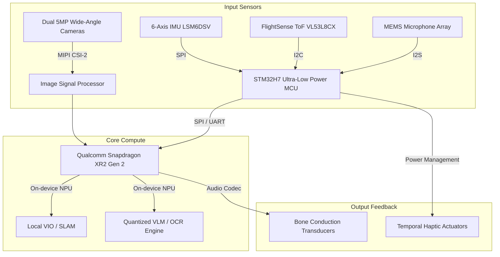

# EyeSync Smart Glasses: Technical Specification & Manufacturing Plan
**Version 1.1 // Lead Product Designer & Senior Engineering Specifications**

---

## 1. Executive Summary & Product Concept
The **EyeSync Smart Glasses** is an assistive wearable designed to close the 80% visual information void for Visually Impaired (VI) and elderly users. Rather than relying on cloud-tethered streaming (which creates high latency and privacy risks), EyeSync operates a local, high-efficiency hybrid compute architecture to translate physical spaces, kiosks, and hazards into real-time auditory guides.

### Core Use Cases:
1. **Interactive Spatial Navigation**: The user states a destination (e.g., *"Where is the bathroom?"*). The glasses map the environment, calculate the optimal path, and provide directional audio prompts while scanning for dynamic obstacles (e.g., wet floors, stray bags, open doors).
2. **Kiosk & Interface Interaction**: The glasses recognize public touchscreens (e.g., fast-food ordering kiosks, ATM screens, subway ticketing machines), parse the text and layout, announce options via bone-conduction audio, and guide the user's physical hand to the correct coordinates on the glass.
3. **Elderly Assistance Mode**: Features automated fall detection, medication label reading, and high-contrast digital text magnification (via companion devices).

---

## 2. System Architecture & Hardware Specification



### 2.1 Hardware Component Specifications
*   **Dual Cameras**: 2x Omnivision OV5675 5MP sensors (1/5" optical format, 1.12µm pixel size). Mounted at the frame temples to match human interpupillary distance, enabling stereoscopic depth mapping.
*   **Time-of-Flight (ToF) Ranger**: STMicroelectronics VL53L8CX 8x8 multizone ranging sensor. Provides active depth mapping up to 4 meters under any lighting condition, ensuring obstacle detection in low light.
*   **Inertial Measurement Unit (IMU)**: STMicroelectronics LSM6DSV 6-axis IMU with embedded finite state machine for step tracking and fall detection.
*   **Audio Output**: Dual bone-conduction transducers mounted on the temporal bone arm. Keeps the ear canal open, allowing users to maintain full ambient acoustic awareness of their surroundings.
*   **Compute Unit**: 
    *   **Primary System-on-Chip (SoC)**: Qualcomm Snapdragon XR2 Gen 2, featuring an integrated Hexagon NPU (delivering up to 15 INT8 TOPS of local AI compute).
    *   **Co-Processor**: STM32H7 dual-core ARM Cortex-M7 microcontroller for low-power sensor fusion, microphone voice trigger wake-word monitoring, and power rail management.
*   **Battery System**: Dual 320mAh Lithium-Polymer pouch cells shaped inside the temple arms (total 640mAh, 3.8V). Hot-swappable magnetic connection allows charging without taking off the frames.
*   **Total Weight Target**: **62 grams** (typical non-smart plastic glasses weigh 30-40g; 62g is optimized for all-day comfort without nose bridge fatigue).

---

## 3. Software Pipeline & Computational Logic

### 3.1 Local Natural Language Interaction (Speech-to-Text & VLM)
To execute offline verbal commands (e.g., *"Find the exit"*), the software utilizes a quantized wake-word engine and a local small language model:
1. **Acoustic Wake-Word detection**: The low-power STM32H7 microcontroller continuously monitors mic feeds for the wake word using a local, sub-1MB neural net (e.g., Syntiant NDP120 pipeline).
2. **Local Transcription**: The audio buffer is passed to a quantized Whisper-Tiny engine running on the Snapdragon NPU, translating speech to text locally in under 120ms.
3. **Intent Parsing**: The text is fed into a quantized 1.1B parameter LLaMA-style model (quantized to INT4) to extract intent (Destination: `bathroom`, Task: `navigation`).

### 3.2 Dynamic Obstacle & Hazard Mapping
```
   [Camera Video Feed] ──> [Mobile-FastSAM (NPU)] ──> [Segmented Obstacle Masks]
                                                            │
   [ToF Depth Vector] ───> [Point-Cloud Fusion]  ───> [3D Collision Trajectory]
                                                            │
   [Spatial Guide Output] <── [Acoustic Audio Warning] <────┘
```
*   **Visual-Inertial Odometry (VIO)**: A lightweight SLAM algorithm integrates IMU acceleration data with camera feature points to track the user's 3D position inside unmapped structures.
*   **Fast Segmentation**: Runs **Mobile-FastSAM** on the NPU to isolate floor grids, detecting level changes (steps, drop-offs) and dynamic obstacles (moving pedestrians, pet hazards) within a 3-meter radius.
*   **Audio Navigation Prompting**:
    *   If a path is clear: The system generates a spatialized periodic sound click (panned to the left/right earbud to indicate walking angle).
    *   If a hazard is detected: Interrupts with a direct voice alert: *"Obstacle detected, step right."*

### 3.3 Kiosk Touchscreen Assistance Algorithm
```
[User faces kiosk] ──> [Capture High-Res Frame] ──> [Run Local Screen-YOLO]
                                                            │
[Spatial Voice Guide] <── [Calculate Hand Delta] <── [Track User's Hand Index]
```
1. **Screen Detection**: A localized YOLO-based object detector identifies rectangular screen boundaries of kiosks.
2. **Optical Character Recognition (OCR)**: Tesseract-OCR or custom quantized text-detection models extract all words on screen and map their exact pixel coordinate bounding boxes $(x_1, y_1, x_2, y_2)$.
3. **Interactive Audio Readout**: The VLM converts the buttons on screen into an audio list (e.g., *"Select 1: Beef Burger, Select 2: Chicken Sandwich. Say your selection."*).
4. **Hand Guidance Tracking**:
    *   The camera tracks the coordinate of the user's index finger in 3D space.
    *   The system calculates the vector difference between the user's hand and the targeted button.
    *   Auditory guidance guides the hand: *"Move hand up 3 inches, right 2 inches... press."*

---

## 4. Bill of Materials (BOM) & Sourcing Specification
Estimated costs are calculated for a production run of **50,000 units**.

| Category | Component Description | Supplier / Mfg | Unit Cost (USD) |
| :--- | :--- | :--- | :--- |
| **Compute** | Qualcomm Snapdragon XR2 Gen 2 | Qualcomm | $45.00 |
| **Co-Process**| STM32H7 Dual-Core Microcontroller | STMicroelectronics | $6.50 |
| **Sensors** | Omnivision 5MP Wide Camera Sensors (x2) | Omnivision | $7.80 |
| **Sensors** | LSM6DSV IMU + VL53L8CX ToF Array | STMicroelectronics | $4.20 |
| **Audio** | Bone Conduction Transducers (x2) | AfterShokz OEM | $8.00 |
| **Battery** | Custom Li-Po Pouch Cells 320mAh (x2) | Grepow Battery | $3.50 |
| **Optics** | Clear Demo Lenses (Optional Prescription compatible) | Essilor OEM | $2.20 |
| **Enclosure** | TR90 Memory Polymer Injection Frame | Custom Tooling | $5.00 |
| **PCB** | 10-layer Rigid-Flex PCB | dynamic-flex | $6.50 |
| **Assy / Test**| Final SMT Assembly, Calibration, & Testing | Foxconn / Pegatron | $12.00 |
| **Packaging** | Recycled Cardboard Box + Charge Cable + Manual | Custom | $3.00 |
| **Total COGS**| **Estimated Unit Cost of Goods Sold** | | **$103.70** |

---

## 5. Manufacturing & Assembly Plan

```
[SMT PCB Assembly] ──> [Sensor Alignment Calibration] ──> [Frame Injection & Insertion]
                                                                  │
[Packaging & QC]  <──  [Waterproofing IP54 Coating]  <── [Final System Validation]
```

### 5.1 Injection Molding (TR90 Frame)
*   **Material**: TR90 (Grilamid) Memory Polymer. Selected for its high flexibility, impact resistance, low density, and biocompatibility (preventing skin irritation over long wear cycles).
*   **Process**: High-precision plastic injection molding. The temples require custom internal metal guide tracks to house the micro-ribbon cables linking the cameras, sensors, and battery terminals.

### 5.2 SMT & Rigid-Flex PCB Assembly
*   Due to the curve of the glasses' frame, a **Rigid-Flex PCB** configuration is required. The main compute board sits in the right temple arm, connected via flexible PCB joints through the frame hinge to the sensor arrays on the front bridge and the left battery arm.
*   **SMT Line**: 0201 passives are utilized to maximize board space efficiency. Lead-free reflow profile must be monitored to protect the flexible PCB joints from thermal cracking.

### 5.3 Sensor Calibration & Alignment
*   Stereoscopic cameras must undergo automatic optical alignment calibration on the assembly line to resolve mechanical placement tolerances. 
*   **Calibration Target**: A retroreflective checkerboard target is captured at various distances to calibrate intrinsic and extrinsic camera matrices, writing correction coefficients directly to the SoC’s EEPROM.

### 5.4 Waterproofing (IP54 Rating)
*   To protect against sweat and rain, the final rigid-flex assembly undergoes a hydrophobic conformal nano-coating process (e.g., P2i or HZO vacuum deposition) prior to final mechanical assembly inside the TR90 frame.

---

## 6. Regulatory Compliance & Quality Control (QC)
1. **Optical Safety**: Time-of-Flight sensors utilize Class 1 infrared lasers. Must comply with **IEC 60825-1** to guarantee absolute eye safety under all usage scenarios.
2. **FCC / CE Certification**: The Bluetooth 5.2 and local Wi-Fi telemetry module must undergo EMI/EMC testing under **CFR Title 47 Part 15** and **EN 301 489**.
3. **Battery Safety**: The custom lithium-polymer temple batteries must hold **UN 38.3** and **IEC 62133** certifications for wearable battery configurations.

---

## 7. Prototyping Guide & Sourcing (South Korea Focus)
To construct a functional, developer-grade desktop or wearable MVP of the EyeSync glasses, you can use off-the-shelf components. Because custom rigid-flex PCBs and custom ASICs are not accessible for initial prototyping, this guide outlines the **Reference Prototyping Stack** and provides direct sourcing links for components available for domestic shipping in South Korea.

```
       ┌────────────────────────────────────────────────────────┐
       │             DEVELOPMENT PROTOTYPE ARCHITECTURE         │
       ├────────────────────────────────────────────────────────┤
       │  Primary Edge Compute: Nvidia Jetson Orin Nano (8GB)    │
       │  Sensor Coprocessor:  ESP32-S3 DevKitC-1               │
       │  Spatial Sensors:     VL53L5CX ToF + LSM6DSOX IMU      │
       │  Video Input:         Arducam Wide-Angle USB Camera    │
       │  Audio Output:        MAX98357A I2S + Bone Transducer  │
       └────────────────────────────────────────────────────────┘
```

### 7.1 Korea Electronics Sourcing Directory
These three primary domestic distributors cover all components with standard next-day shipping in South Korea:
*   **Devicemart (디바이스마트)**: `www.devicemart.co.kr` (Best for MCUs, sensors, amplifiers, and breadboard wiring tools).
*   **Eleparts (엘레파츠)**: `www.eleparts.co.kr` (Excellent inventory for Adafruit/SparkFun sensor breakout boards and specialized transducers).
*   **ICbanQ (아이씨뱅큐)**: `www.icbanq.com` (Official Nvidia Jetson and Raspberry Pi distributor in Korea, best for compute boards and camera modules).

---

### 7.2 Hardware Component Sourcing Details & Direct Search Keys

#### A. Primary Edge Compute Node: Nvidia Jetson Orin Nano Developer Kit (8GB)
*   **Purpose**: Runs the local VIO/SLAM tracking and handles local YOLO-based object/screen segmentation.
*   **Where to Buy**: [ICbanQ - Jetson Orin Nano Developer Kit](https://www.icbanq.com/P014603348)
*   **Search Term (Devicemart/Eleparts)**: `젯슨 오린 나노 개발자 키트`

#### B. Wearable Sensor Coprocessor: ESP32-S3-DevKitC-1 (N16R8)
*   **Purpose**: Low-power controller mounted on the physical frames to interface with the IMU and ToF sensors via I2C, streaming parsed coordinates over Wi-Fi/Bluetooth to the Jetson Nano or smartphone.
*   **Where to Buy**: [Devicemart - ESP32-S3-DevKitC-1](https://www.devicemart.co.kr/goods/view?no=14397722)
*   **Search Term**: `ESP32-S3 개발보드` or `ESP32-S3-DevKitC`

#### C. Optical Input: Arducam 5MP Wide Angle USB Camera Module
*   **Purpose**: Simulates the glasses' temple cameras. Sourced as a USB module for direct plug-and-play validation on the Jetson developer kit.
*   **Where to Buy**: [Eleparts - Arducam USB Camera](https://www.eleparts.co.kr/goods/view?no=10738600)
*   **Search Term**: `아두캠 USB 카메라` or `Arducam wide angle`

#### D. Time-of-Flight (ToF) Spatial Array: VL53L5CX 8x8 Multizone Sensor Breakout
*   **Purpose**: Provides active multizone depth mapping. Communicates via I2C to the ESP32-S3.
*   **Where to Buy**: [Devicemart - VL53L5CX Breakout](https://www.devicemart.co.kr/goods/view?no=14185794)
*   **Search Term**: `VL53L5CX` or `VL53L8CX`

#### E. Inertial Measurement Unit (IMU): LSM6DSOX (or LSM6DSV) 6-Axis IMU Breakout
*   **Purpose**: Tracks step vectors and runs the hardware-level fall detection.
*   **Where to Buy**: [Eleparts - Adafruit LSM6DSOX Board](https://www.eleparts.co.kr/goods/view?no=9782500)
*   **Search Term**: `LSM6DSOX` or `LSM6DS33`

#### F. Bone Conduction Audio Output: Bone Conduction Transducer (8 Ohm, 1W)
*   **Purpose**: Provides auditory spatial direction without blocking the ear canal.
*   **Where to Buy**: [Devicemart - Bone Conduction Transducer](https://www.devicemart.co.kr/goods/view?no=1327461)
*   **Search Term**: `골전도 트랜스듀서` or `Bone Conduction Transducer`

#### G. Audio DAC/Amplifier: MAX98357A I2S Class D Amplifier
*   **Purpose**: Decodes digital I2S audio signals from the ESP32-S3 or Jetson into clean analog sound to drive the bone conduction transducer.
*   **Where to Buy**: [Eleparts - MAX98357 I2S Amp](https://www.eleparts.co.kr/goods/view?no=9635400)
*   **Search Term**: `MAX98357` or `I2S 앰프`

---

### 7.3 DIY Hardware Wiring & Assembly Blueprint

```
    [ESP32-S3 GPIO Pins]
      ├── Pin 21 (SDA) ──────> [VL53L5CX SDA] & [LSM6DSOX SDA]  (I2C Data Line)
      ├── Pin 22 (SCL) ──────> [VL53L5CX SCL] & [LSM6DSOX SCL]  (I2C Clock Line)
      ├── Pin 25 (I2S_LRCK) ──> [MAX98357 LRC]                   (Audio Frame Sync)
      ├── Pin 26 (I2S_BCLK) ──> [MAX98357 BCLK]                  (Audio Bit Clock)
      └── Pin 27 (I2S_DOUT) ──> [MAX98357 DIN]                  (Audio Data In)

    [MAX98357 Speaker +/- Out] ──> [Bone Conduction Transducer Leads]
```

#### Assembly Setup:
1. **Chassis Preparation**: 3D print a reference safety-glasses frame (search Thingiverse for "Smart Glasses Frame Dev Kit"). If a 3D printer is unavailable, purchase a pair of industrial clear safety glasses (available at any local hardware store or search `3M 보안경` on Naver Shopping) and use heat-shrink tubing/hot glue to mount the sensors.
2. **Sensor Mounting**: Mount the **Arducam** at the right-side hinge. Mount the **VL53L5CX ToF** sensor directly on the nose bridge pointing forward.
3. **Audio Mounting**: Fix the **Bone Conduction Transducer** against the temple arms so that they press firmly against your temporal bones when wearing the glasses.
4. **Cabling**: Route flexible thin-gauge jumper wires from the nose bridge and temple components to a central prototyping breadboard. Connect the breadboard to the **ESP32-S3** and the **Jetson Orin Nano** on your desk.

---

### 7.4 Initial Software Deployment Guide

#### 1. ESP32-S3 Sensor Processing
*   Install the **ESP-IDF** extension or Arduino IDE.
*   Import the `SparkFun_VL53L5CX_Library` to parse the 8x8 depth array.
*   Write a basic firmware loop that polls the ToF sensor at 15Hz and packages the data into a JSON string:
    ```cpp
    // Sample Pseudo-read Loop
    void loop() {
      if (myImu.gyroscopeAvailable() && myToF.isDataReady()) {
        float x_accel = myImu.readFloatAccelX();
        // Parse 8x8 grid arrays
        sendSensorTelemetry(x_accel, tofMatrix);
      }
      delay(66); // 15Hz frequency
    }
    ```
*   Stream this JSON packet over a local UDP broadcast socket over local Wi-Fi.

#### 2. Jetson Orin Nano Object Recognition Setup
*   Flash your Jetson with **JetPack 5.1.1** or newer.
*   Install PyTorch with CUDA support to enable GPU acceleration on the Orin Nano.
*   Clone the Ultralytics YOLO repository and load a quantized **YOLOv8n** (nano) weight file:
    ```bash
    pip install ultralytics
    python -c "from ultralytics import YOLO; model = YOLO('yolov8n.pt')"
    ```
*   Configure the camera stream handler to capture frames from the Arducam (`/dev/video0`), running inference to detect kiosks or dynamic obstacles. Translate detected coordinates into spatial sound prompts, and feed the audio output back to the **MAX98357A** amp over the local network.
